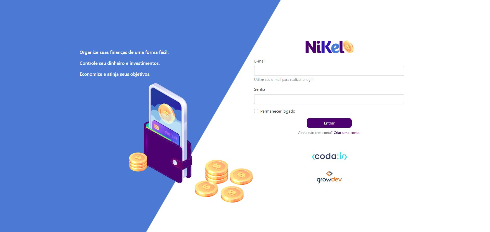
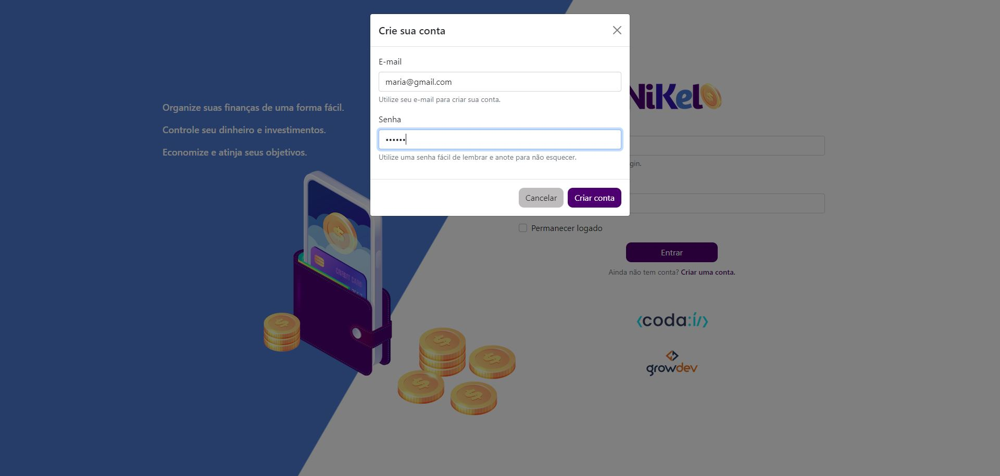
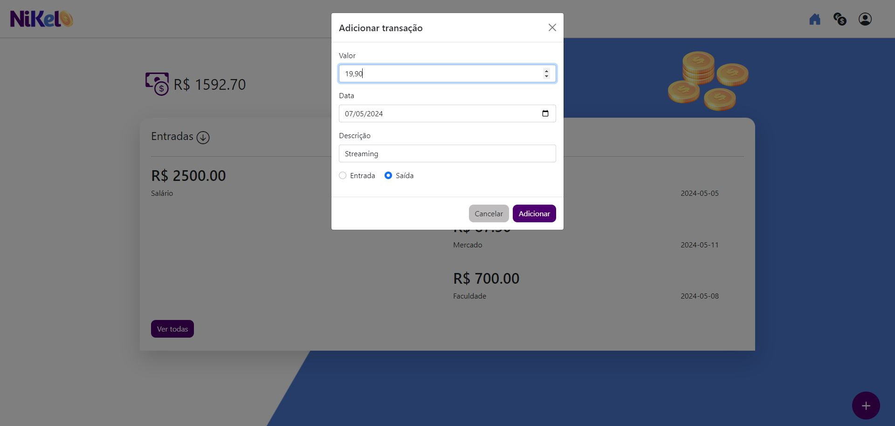
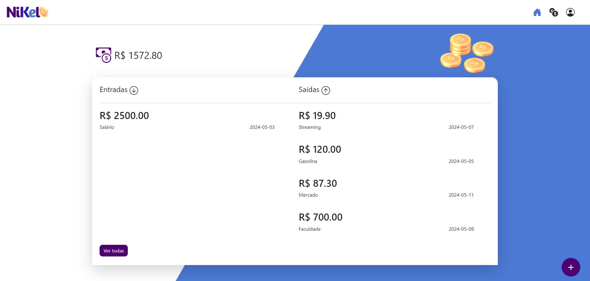

[HTML_BADGE]: https://img.shields.io/badge/html5-%23E34F26.svg?style=for-the-badge&logo=html5&logoColor=white
[CSS_BADGE]: https://img.shields.io/badge/css3-%231572B6.svg?style=for-the-badge&logo=css3&logoColor=white
[JAVASCRIPT_BADGE]: https://img.shields.io/badge/javascript-%23323330.svg?style=for-the-badge&logo=javascript&logoColor=%23F7DF1E
[BOOTSTRAP_BADGE]: https://img.shields.io/badge/bootstrap-%238511FA.svg?style=for-the-badge&logo=bootstrap&logoColor=white
[PROJECT__BADGE]: https://img.shields.io/badge/📱Visit_this_project-000?style=for-the-badge&logo=project
[PROJECT__URL]: https://brunaciarlo.github.io/Nikel/

<h1 align="center" style="font-weight: bold;">Projeto Nikel 💵</h1>

🌐 <a href="#ingles"> _English README</a> below the portuguese_

![HTML_BADGE]
![CSS_BADGE]
![JAVASCRIPT_BADGE]
![BOOTSTRAP_BADGE]

<p align="center">
  <a href="#sobre">Sobre</a> • 
  <a href="#comecando">Começando</a>
</p>

<p align="center">
  
  
  
  
</p>

<h2 id="sobre">📖 Sobre</h2>

Nesse projeto foi criada uma aplicação para gerenciamento de despesas na qual se deve criar uma conta com e-mail e senha, fazer login, e já dentro do sistema é possível inserir movimentações de entrada e saída de dinheiro da conta, inclusive de futuras transações, a fim de ajudar o usuário no seu controle financeiro.

[![project][PROJECT__BADGE]][PROJECT__URL]

<h4>🔒 Importante!</h4>
Nenhum dado inserido nas transações fica salvo em bancos de dados e os dados de login são armazenados em localstorage. É completamente seguro inserir dados reais ou fictícios no site.

<h4>📚 Estudo</h4>
Esse projeto é uma aplicação para estudo de desenvolvimento web front-end.

<h2 id="comecando">🚀 Começando</h2>

Caso queira baixar o projeto para rodar na sua máquina, é necessário seguir os passos a seguir:

<h3>Pré-requisitos</h3>

- [VS Code](https://code.visualstudio.com/) (com extensão Go Live)

<h3>Clonando</h3>

Como clonar

```bash
git clone https://github.com/brunaciarlo/Nikel.git
```

Abrir a pasta do projeto clonado no VS Code e ativar a ferramenta Go Live.

---------------------------------------------------------------------------------------------------------------------------------------

<h1 id="ingles" align="center" style="font-weight: bold;">Nikel Project 💵</h1>

![HTML_BADGE]
![CSS_BADGE]
![JAVASCRIPT_BADGE]
![BOOTSTRAP_BADGE]

<p align="center">
  <a href="#about">About</a> • 
  <a href="#starting">Getting Started</a>
</p>

<p align="center">
  
  
  
  
</p>

<h2 id="about">📖 About</h2>

This project is an cashflow application. You must create an account inserting e-mail and password, login, and insert in the system the cash inflow or outflow, from now or future transfers, with the goal of helping the user to have financial control.
[![project][PROJECT__BADGE]][PROJECT__URL]

<h4>🔒 Important!</h4>
Data inserted in transfer area are not stored in any database and the login data is stored in localstorage. It's completaly safe to insert real ou non real data on the website.

<h4>📚 Study</h4>
This project is an apliccation with the purpose of front-end development study.

<h2 id="starting">🚀 Getting Started</h2>

In case you want to download the code in your machine, follow the next steps:

<h3>Prerequisites</h3>

- [VS Code](https://code.visualstudio.com/) (with Go Live extension)

<h3>Cloning</h3>

How to clone

```bash
git clone https://github.com/brunaciarlo/Nikel.git
```

Open the project folder on VS Code and turn on Go Live.
